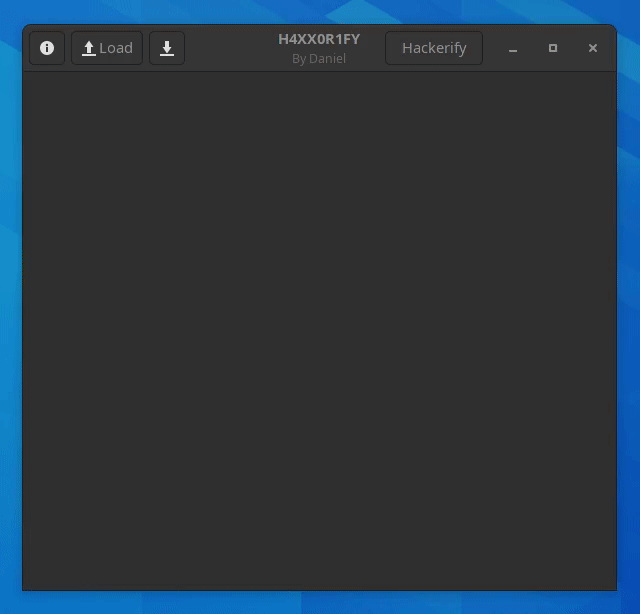

# Hackerify
A simple utility to convert text to L33T SP43K



## Installation
Download the binary for your operating system [here](https://github.com/daniel071/Hackerify/releases)

## Compiling
Make sure to have [Rust](https://www.rust-lang.org/) installed

Most Linux desktop environments come with GTK pre-installed. For Windows and macOS you will need to [install GTK](https://www.gtk.org/docs/installations/)

```shell
git clone https://github.com/daniel071/Hackerify.git
cd Hackerify

# To run
cargo run

# To create a binary
cargo build
```
